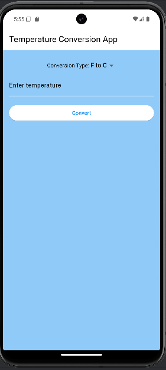

# Temperature Conversion App

A simple Flutter application that allows users to convert temperatures between Fahrenheit and Celsius. The app supports both portrait and landscape orientations and maintains a history of all conversions performed.

## Features

- Convert temperatures between Fahrenheit and Celsius.
- Display converted values up to 2 decimal places.
- Maintain a history of conversion operations.
- Consistent design in both portrait and landscape orientations.

## Demo Video
https://github.com/user-attachments/assets/77630360-4099-4c50-af43-968e1e9e1379
## Screenshots

### Portrait Mode


### Landscape Mode


## Getting Started

### Prerequisites

- [Flutter SDK](https://flutter.dev/docs/get-started/install)
- [Dart SDK](https://dart.dev/get-dart)

### Installation

1. Clone the repository:

   ```sh
   git clone https://github.com/Maxime-Bakunzi/temperature-conversion.git
   cd temp_conversion_app
   ```

2. Install dependencies:

   ```sh
   flutter pub get
   ```

3. Run the app:

   ```sh
   flutter run
   ```

## Project Structure

```
lib/
├── main.dart
├── screens/
│   └── home_screen.dart
├── widgets/
│   ├── conversion_selector.dart
│   ├── conversion_result.dart
│   └── conversion_history.dart
```

### main.dart

The entry point of the application, setting up the MaterialApp and the theme.

### screens/home_screen.dart

The main screen of the app, containing the temperature conversion functionality and the history of conversions.

### widgets/conversion_selector.dart

A widget for selecting the type of conversion (Fahrenheit to Celsius or Celsius to Fahrenheit).

### widgets/conversion_result.dart

A widget for displaying the result of the conversion.

### widgets/conversion_history.dart

A widget for displaying the history of conversions.

## Usage

1. Select the conversion type (F to C or C to F).
2. Enter the temperature value in the input field.
3. Press the "Convert" button to see the converted value.
4. The conversion result will be displayed, and the operation will be added to the history.

## Formulae

- Fahrenheit to Celsius: °C = (°F - 32) × 5/9
- Celsius to Fahrenheit: °F = °C × 9/5 + 32

## Author

- Maxime Guy Bakunzi

## Acknowledgments

- [Flutter Documentation](https://flutter.dev/docs)
- [Dart Documentation](https://dart.dev/guides)
